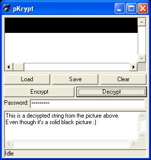



## \_ pKrypt \(Encrypt a string into a picture\.  Unreadable by anyone without the password\) \_

### Description

Takes any string and password and converts them into a solid black picture. Unreadable by anyone that does not have the password and this program. Please Vote :)
 
### More Info
 

             |
---                |---
**Submitted On**   |2004-04-24 10:52:14
**By**             |[KRYO\_11](https://github.com/Planet-Source-Code/PSCIndex/blob/master/ByAuthor/kryo-11.md)
**Level**          |Advanced
**User Rating**    |4.3 (26 globes from 6 users)
**Compatibility**  |VB 6\.0
**Category**       |[Encryption](https://github.com/Planet-Source-Code/PSCIndex/blob/master/ByCategory/encryption__1-48.md)
**World**          |[Visual Basic](https://github.com/Planet-Source-Code/PSCIndex/blob/master/ByWorld/visual-basic.md)
**Archive File**   |[\_\_pKrypt\_\(1737094242004\.zip](https://github.com/Planet-Source-Code/kryo-11-pkrypt-encrypt-a-string-into-a-picture-unreadable-by-anyone-without-the-password__1-53358/archive/master.zip)

